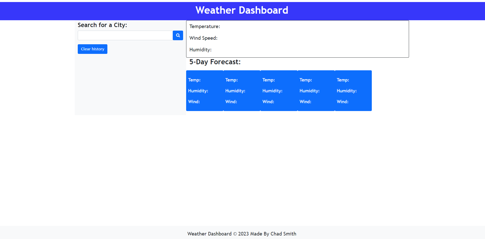

# Weather Dashboard Challenge

## Description

Creating code from scratch build a weather dashboard that meets the below criteria:

- When I search for a city, the current and future conditions for that city are disabled and city is added to search history.
- I am presented with the city name, date, and icon representing the weather condition, the temperature, humidty, and the wind speed.
- I am presented with a 5-day forecast that displays the date, an icon representation of weather conditions, the temperature, the wind speed, and the humidity.
- I can click on a city within the search history and be displayed with the current and future conditions for that city.

- Link to working URL: [Weather dashboard](https://csmith0414.github.io/weather-dashboard/)

## Usage

To provide a portfolio for the developer to provide example of their work

## Credits

N/A

## License

Please refer to the LICENSE in the repo.